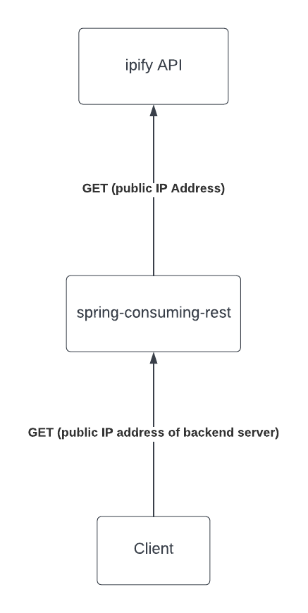

# spring-consuming-rest

A demo Spring application which consumes an external REST API (https://www.ipify.org/).

This application expose an API endpoint `/ip` to return the public IP Address of the server which it is running on.

